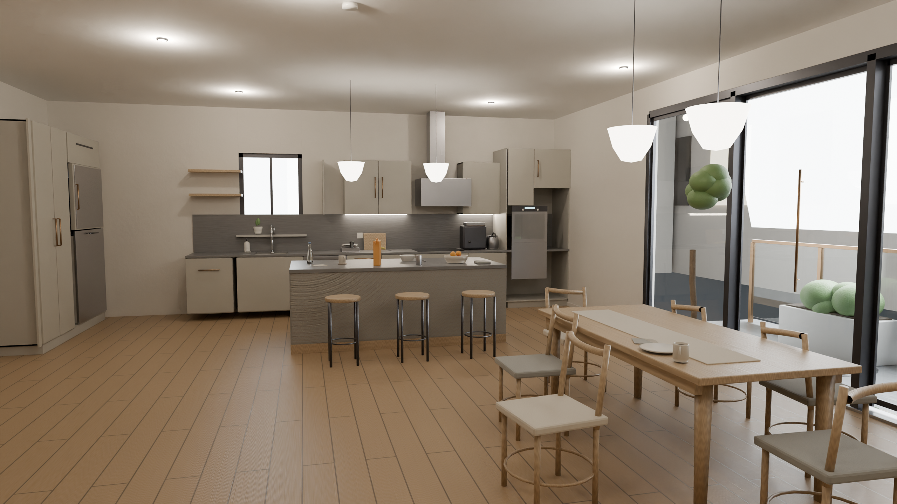
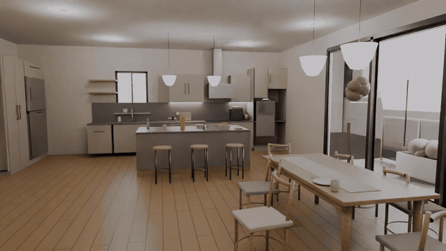
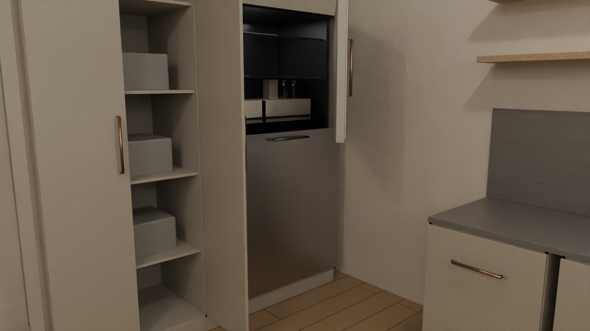
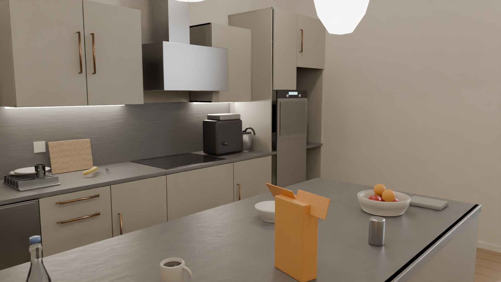
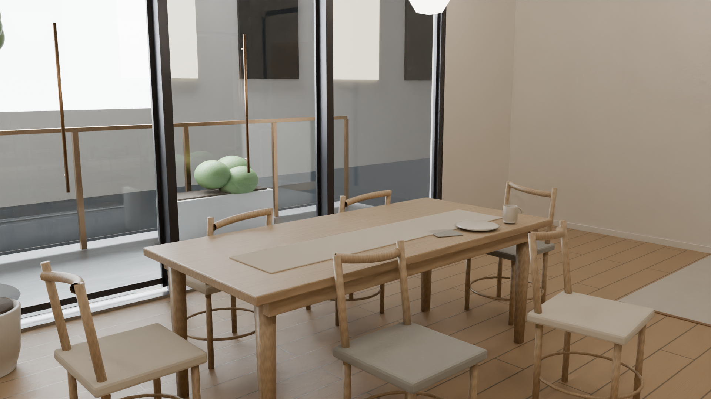
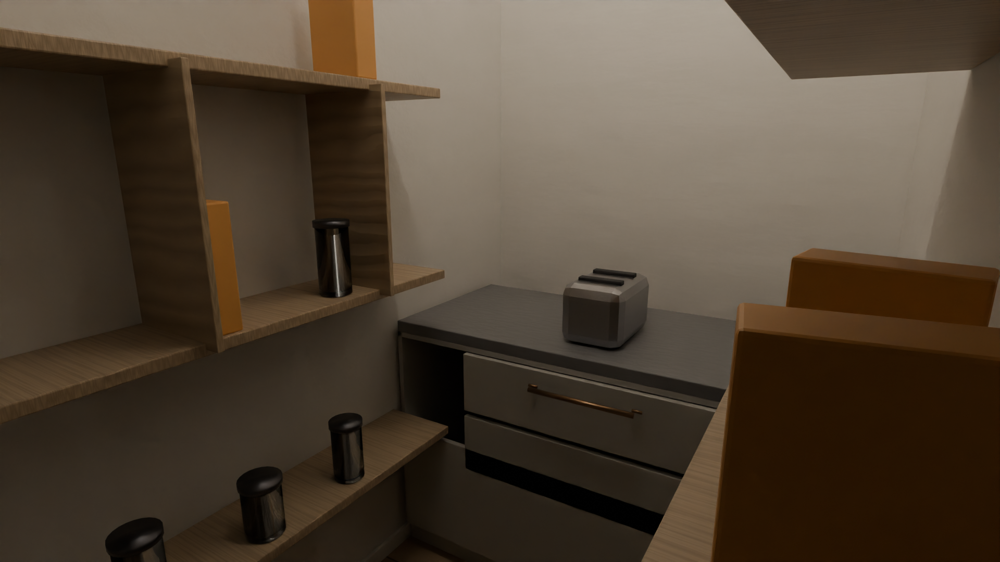

# GLM Skills · Sim-Ready Interactive Kitchen

<p align="center">
  
</p>

<p align="center">
  <a href="videos/kitchen_promo.mp4"></a>
</p>

**One agent skill that turns a one-line prompt into a validated, interactive, MuJoCo-ready Blender scene — autonomously.**

GLM-5.3-Flash designed a 9.8 × 7.4 m open-plan kitchen (preparation wall, island,
walk-in pantry, dining, terrace), built it from parametric constants, drove it
through four geometric validation gates and a 4-cycle render-review-repair loop,
exported a MuJoCo MJCF with **19 articulated joints**, and produced the promo
video. No hand-fixes to the scene files.

▶ 18-second tour in [`videos/kitchen_promo.mp4`](videos/kitchen_promo.mp4)

## ⚡ Quick Start

```bash
git clone https://github.com/hxwxss/glm-skills-interactive-scenes.git
cd glm-skills-interactive-scenes

# Blender 4.1.1 (Linux, headless) rebuilds scene + IR from constants
blender --background --factory-startup --python pipeline/build_scene.py

# geometric validation gates G1–G4
blender --background scene/interactive_kitchen.blend --python pipeline/validate_scene.py

# MuJoCo validation of the sim export (needs: pip install mujoco numpy)
python pipeline/validate_mjcf.py sim_ready/kitchen_mjcf/kitchen.xml

# interactive viewer — drag the 19 joint sliders
DISPLAY=:0 python -m mujoco.viewer --mjcf sim_ready/kitchen_mjcf/kitchen.xml
```

Requires Blender 4.1.1 (headless) and Python 3.10+ with `mujoco`/`numpy`.
Full-quality renders in [`renders/final/`](renders/final/).

## 🎬 Judgeset & demo

The 12-camera judgeset is the acceptance test — re-rendered after every repair
cycle, inspected as pixels:

| View | Shows | |
|---|---|---|
| **Hero entry reveal** (banner) | full spatial read |  |
| **Articulated storage open** | fridge + tall cabinet + interiors |  |
| **Cooking & oven zone** | induction, hood, oven column |  |
| **Breakfast dining** | glazing, pendants, lived-in story |  |
| **Walk-in pantry** | real 1.5 m depth, jars, drawers |  |

All 12 cameras live in [`renders/final/`](renders/final/); the 18-second promo in
[`videos/`](videos/); a browser gallery at [`docs/index.html`](docs/index.html) (GitHub Pages–ready).
(GitHub Pages–ready).

## 🧠 The Skill

[`skills/interactive-scene-sim-ready/SKILL.md`](skills/interactive-scene-sim-ready/SKILL.md)
packages the whole methodology as a reusable agent skill:

- **6 pipeline stages** — runtime contract → planning docs → parametric builder →
  render-review-repair loop → validation gates → sim export & delivery
- **7 Blender pitfalls** that each cost a real debug cycle (object-scale leaks
  into textures/bevels/children; parent-local authoring; open-fronted carcasses;
  hinge-sign conventions; limit collisions; IDProperty falsiness; pixels > bboxes)
- **G0–G6 gate definitions** with machine-checkable acceptance criteria
- **MuJoCo export traps** — keyframe qpos is always radians, OBJ axes import
  identity, meshdir resolution, collision-only ceilings

Drop it into `~/.agents/skills/` and the agent can rerun the methodology on any
new interior: copy the reference implementation, rewrite `kit_params.py`, keep
the conventions.

## 📁 Repository

```text
├── skills/interactive-scene-sim-ready/   the skill (stages, gates, pitfalls)
├── pipeline/                             build + validate + export + render scripts
│   ├── kit_params.py                     single source of truth (all dimensions)
│   ├── build_scene.py                    factory-startup scene builder
│   ├── validate_scene.py                 G1–G4 geometric gates
│   ├── export_mjcf.py / validate_mjcf.py sim export + physics validation
│   └── render_judgeset.py / render_promo_video.py / ...
├── scene/interactive_kitchen.blend       final scene (opens headlessly)
├── scene/scene_ir/kitchen_scene_ir.json  objects, joints, tasks, robot route
├── sim_ready/kitchen_mjcf/               MJCF + 42 visual meshes
├── renders/final/                        12-camera judgeset (Cycles)
├── videos/kitchen_promo.mp4              18 s promo (24 fps, H.264)
├── docs/                                 browser gallery (docs/index.html) + validation evidence
```

## 🙈 Honest limitations

- Collision proxies are AABBs — curved props (faucet, plants) are conservative
  boxes; no convex decomposition yet.
- Sim visual meshes carry flat rgba, not baked PBR textures.
- Appliance interiors are credible suggestions, not full models.

## 📄 License

MIT — see [`LICENSE`](LICENSE).
